# Deploy a Dynamic WordPress Website on AWS (Host a WordPress Website on AWS)


`3-tier VPC Architecture`

Welcome Cloud advocates to another journey of cloud exploration using the provider AWS. In today’s project, we will use AWS management console to deploy a dynamic WordPress website. We are going to use various AWS services (3-tier vpc architecture from scratch with public and private subnets, security groups, NAT gateways, ec2 instances, rds, application load balancer, route53, auto scaling group, certificate manager, efs, and more)

## Step 1: Build a Virtual Private Cloud (VPC) with public and private subnet

We will be using the architecture diagram above to create a 3-tier VPC. In the first tier, we will have public subnet which will hold resources such as NAT Gateway, Application Load balancer. In the second tier, we will have private subnets containing resources such as our web server and in the third tier, we will have other private subnets which will have the RDS database. We will duplicate these subnets across multiple availability zones (AZ) for high availability and fault tolerance. Resources in our VPC will access the internet via internet and NAT gateways using route tables.

### I. Create a Custom 3-tier VPC
  1. From the management console, first, select the region to create the VPC, in our case, it will be ***us-east-1***
  2. In the Search box, type VPC and select VPC under services
  3. click on ***Create VPC***
  4. Give a name (we will be using ***My VPC***)
  5. In the IPv4 CIDR field, enter an IP address (this is a classless inter-domain routing IP address range), as per our architecture, it will be ***20.1.0.0/16***
  6. We will leave IPv6 (***No IPv6 CIDR block***) and tenancy (***Default***) unchanged
  7. Click ***Create VPC***
  8. We can view your VPC by using the filter box and selecting your VPC name.

### II. Enable DNS Hostname in your VPC (this will enable it to resolve any domain name specified in a private hosted zone in Route 53)
  1. Select the VPC created in (I) above
  2. Goto Actions -> Edit DNS hostnames
  3. Check the ***Enable DNS hostnames*** box and save changes

### III. Create an Internet gateway for your VPC
  1. On the VPC page, on the left, select Internet Gateways -> Create internet gateway
  2. Give it a name (we will use ***My Internet Gateway***) and click Create internet gateway

### IV. Attach the internet gateway created in (III) above to your VPC (this allows instances in the VPC to communicate with the internet)
  1. Click the Attach button shown on the notification (in green)
  2. Under Available VPCs, we select our VPC (it will only show VPCs that have no internet gateway attached to it).
  3. Click ***Attach internet gateway***. The status will now show Attached 

### V. Create Public subnets in the 1st and 2nd Availability Zones
  1. On the VPC page, select Subnets -> Create subnet
  2. Select the VPC where we want to create the subnet from the dropdown (in our project it will be ***My VPC***)
  3. Under Subnet name, enter a name (we will be using ***Public Subnet AZ1***)
  4. Under Availability Zone, select ***us-east-1a*** (according to our reference architecture)
  5. Under IPv4 CIDR block, enter ***20.1.0.0/24***
  6. Click Create subnet
  7. Repeat steps (a) to (e) and create the 2nd subnet with name as ***Public Subnet AZ2***, availability zone as ***us-east-1b*** and IPv4 CIDR as ***20.1.1.0/24***
  8. Filter by our VPC to see the 2 subnets just created 

### VI. Enable the Auto-assign IP settings for the 2 public subnets (this enables any instance launched in these subnets to be assigned a public IPv4 address
  1. Select the first subnet (*Public Subnet AZ1*)
  2. Goto to Actions -> Edit subnet settings
  3. Under Auto-assign IP settings, enable the check box
  4. Scroll down and click save
  5. Do the same for second subnet (*Public Subnet AZ2*)

### VII. Create a Public Route Table, add a route and associate the 2 public subnets (this determines where network traffic is directed from our gateway or subnet)
  1. With our VPC still filtered, we will see one route table (which is the default, and is private, generally called the main)
  2. On the left side, select Route tables -> Create route table
  3. Under Name, give a name (we will use ***Public Route Table***)
  4. Next, select the VPC where we want to create the route table (we will select ***My VPC*** from the dropdown)
  5. Click on create route table 
  6. To add a route, under the route tab, click Edit routes -> Add route
  7. Under destination, enter ***0.0.0.0/0***, under target select our internet gateway (we will select ***My Internet gateway***), then save changes
  8. To associate the public subnets to this route table, under the Subnet associations tab, click Edit subnet associations
  9. At this moment, we will see the 2 non-associated subnets in the VPC, select both *Public Subnet AZ1* and *Public Subnet AZ2*
  10. Save associations  
  

### VIII. Create our 4 private subnets

Follow the same steps in **(V)** above to create the 4 subnets under our VPC with the following details:
  1. 1st Private subnet => Name: ***Private App Subnet AZ1***, availability zone: ***us-east-1a***, IPv4 CIDR: ***20.1.2.0/24***
  2. 2nd Private subnet => Name: ***Private App Subnet AZ2***, availability zone: ***us-east-1b***, IPv4 CIDR: ***20.1.3.0/24***
  3. 3rd Private subnet => Name: ***Private Data Subnet AZ1***, availability zone: ***us-east-1a***, IPv4 CIDR: ***20.1.4.0/24***
  4. 4th Private subnet => Name: ***Private Data Subnet AZ2***, availability zone: ***us-east-1b***, IPv4 CIDR: ***20.1.5.0/24***
  5. We can filter by our VPC and see the total 6 subnets. 

***FACTS:***
  *// Any route table that directly routes traffic to the internet via an internet gateway is considered a public route table*
  *// Any subnet associated with a public route table is considered a public subnet*
  *// A default route table is created when you create a vpc and it’s private by default, it’s also called the main route table*
  *// The default route table routes traffic within the VPC*
  *// Any subnet that is not explicitly associated to a route table is automatically associated with the default route table and hence **considered private subnets*
  *// The 4 subnets created in (VIII) above are all private*

## Step 2: Create Nat Gateways, Private Route tables in the first and second Availability Zones

We will create 2 Nat gateways in both Public subnets, create 2 private route tables in AZ1 and AZ2 respectively with each having a route to the internet via the Nat gateway, then we will associate both private app subnets and private data subnets in AZ1 to the route table in AZ1, likewise, both private app subnets and private data subnets in AZ2 to the route table in AZ2. We will make sure to be in the right region.

### I. Create Nat Gateways
  1. On the VPC dashboard, on the left side, select Nat Gateways -> Create Nat gateway
  2. Give it a name (we will use ***Nat Gateway AZ1***) and click Create internet gateway
  3. Select the subnet we want to create the Nat Gateway, (it will be ***Public Subnet AZ1***)
  4. Connection type, select ***Public***
  5. Under Elastic IP allocation ID, click on ***Allocate Elastic IP*** (this will allocate an elastic IP to this Nat gateway)
  6. Click ***Create NAT gateway***.
  7. Repeat steps (1) to (6) to create 2nd Nat Gateway with name: ***Nat Gateway AZ2*** and subnet: ***Public Subnet AZ2*** 

### II. Create Route Tables and add routes
1. On the left side, select Route tables -> Create route table
2. Under Name, give a name (it will be ***Private Route Table AZ1***)
3. Select the VPC from the dropdown list we want to create this route table in (in our project, it will be ***My VPC***)
4. To add a route, under the route tab, click Edit routes -> Add route
5. Under destination, enter ***0.0.0.0/0***, under target, select a Nat gateway (***Nat Gateway AZ1***) from dropdown, then save changes
6. While still in “Private Route Table AZ1”, to associate the private subnets to this route table, under the Subnet associations tab, click Edit subnet associations
7. At this moment we will see the 4 non-associated subnets in our VPC, select both Private App Subnet AZ1 and Private Data Subnet AZ1
8. Save associations
9. Repeat steps (1) to (8) to create a second route table with name: ***Private Route Table AZ2***, route destination ***0.0.0.0/0*** and target ***Nat Gateway AZ2***, and associate both Private App Subnet AZ2, Private Data Subnet AZ2. 

***FACTS:***
*// With this setting, the 4 private subnets can access the internet via the Nat gateways in the public subnets*

## Step 3: Create Security Groups
We will create the following security groups; Application Load Balancer (ALB) Security Group, SSH Security Group, Webserver Security Group, Database Security Group, EFS Security Group, EIC Endpoint Security Group, EC2-Instance Security Group. This is to add a layer 3 and 4 (network/Transport layer of the OSI model) security to our infrastructure by controlling what is allowed in and out of a resource within our VPC.

- eic-endpoint-sg: Open outbound traffic on port 22 and use the VPC CIDR for the source destination.

- ec2-instance-sg: Open inbound traffic on port 22 and use the eic-endpoint-sg for the source destination.

### I. ALB Security Group
Inbound Rules:
- HTTP (80),   source: 0.0.0.0/0 (from anywhere)
- HTTPS (443), source: 0.0.0.0/0 (from anywhere)

  1. On the VPC dashboard, on the left side, select Security Groups -> Create security group
  2. Give it a name (it will be ***ALB Security Group***), use same name as description (or anything of your choice)
  3. Under VPC, remove the default selected vpc and select our VPC (***My VPC***) from the dropdown list
  4. Under Inbound rules, click Add rule, under Type, select ***HTTP*** (port 80), under source, type ***0.0.0.0/0***
  5. Repeat (4) and add ***HTTPS*** (port 443) rule with source ***0.0.0.0/0***
  6. Scroll down and click create security group

### II. SSH Security Group
Inbound Rule:
- SSH (22), source: Our IP address

  1. Follow the steps in (I) above with following details, name: ***SSH Security Group***, Type: ***SSH*** (port 22), source: select ***My IP***
  2. Scroll down and click create security group

### III. EIC Endpoint Security Group
Outbound Rule:
- SSH (22), source: our VPC CIDR block (in our project, it is ***20.1.0.0/16***)

  1. On the VPC dashboard, on the left side, select Security Groups -> Create security group
  2. Give it a name (it will be ***EIC Endpoint Security Group***), use same name as description
  3. Under VPC, remove the default selected vpc and select our VPC (***My VPC***) from the dropdown list
  4. Under Outbound rules, click Add rule, under Type, select ***SSH*** (port 22), under source, type ***20.0.0.0/16***
  5. Scroll down and click create security group

### IV. EC2-Instance Security Group
Inbound Rules:
- SSH (22), source: EIC Endpoint Security Group
- SSH (22), source: Our IP address
This enables us connect directly to any ec2 instance in any subnet, public or private in our vpc without the use of keypairs

  1. Follow the steps in (I) and create a security group with name ***EC2-Instance Security Group*** with 2 inbound rules as stated above
  2. Scroll down and click create security group

### V. Webserver Security Group
Inbound Rules:
- HTTP (80),   source: ALB Security Group
- HTTPS (443), source: ALB Security Group
- SSH (22),    source: SSH Security Group

  1. Follow the steps in (I) above with inbound rules details as stated above
  2. Scroll down and click create security group

### VI. Database Security Group (Port: 3306 with source: Webserver security group)
Inbound Rule:
- MYSQL/Aurora (3306), source: Webserver Security Group

  1. Follow the steps in (I) above with inbound rules details as stated above
  2. Scroll down and click create security group

### VII. EFS Security Group
Inbound Rules:
- NFS (2049),   source: Webserver Security Group
- SSH (22), source: SSH Security Group

  1. Follow the steps in (I) above with inbound rules details as stated above
  2. Scroll down and click create security group
  3. While still on the EFS security group page, click on Edit inbound rule -> Add another rule with Type: ***NFS*** (port 2049), source: ***EFS Security Group***
  4. Scroll down and click safe rule 
  


## Step 4: Create RDS Instance (database)

We will create the rds instance in the private data subnet. This will contain our Website database

### I. Create the subnet group.

This allows us to specify in which subnet(s) we want to create our database

  1. From the management console, type *rds* in the search box and select RDS under services.
  2. On the left side, select *Subnet group* -> Create DB Subnet group
  3. Give it a name (we will call it ***Database subnets***), use same name for the description
  4. Under VPC, select our VPC (***My VPC***) from the dropdown list
  5. Under Availability Zones, select the 2 availability zones (it will be ***us-east-1a***, ***us-east-1b***)
  6. Under subnets, select the IP CIDR block that corresponds to the 2 subnets (***20.1.4.0/24*** for Private data Subnet AZ1, ***20.1.5.0/24*** for Private data subnet AZ2)
  7. Scroll down and click create
  

### II. Create database.
  1. On the left side, select database -> Create database
  2. For database creation method: ***Standard create***
  3. engine type: ***MySQL***
  4. Under version, select the latest version from dropdown list
  5. template: ***Dev/Test***
  6. Availability and durability: ***Single DB instance*** (according to our reference architecture, we can select “Multi-AZ DB instance” to create a standby database, but we will select the single so we are not billed)
  7. DB instance identifier: enter ***test-rds-db***
  8. Master username: enter a username (we will use ***test24***)
  9. Master password: enter a password (we will use ***Test1234***)
  10. DB instance class: ***Burstable classes (includes t classes)***, toggle ***include previous generation classes*** then select ***db.t2.micro*** from the dropdown (this is the free-tier one)
  11. storage: enter ***20***
  12. Under VPC, select our vpc name (***My VPC***)
  13. subnet group: select the subnet we created in step 4(I) above
  14. public access: select ***No***
  15. VPC security group: ***Choose existing***, then remove the default security group, select ***Database Security group*** from the dropdown
  16. Availability Zone: select ***us-east-1b***
  17. database authentication: check “Password authentication”
  18. Expand “Additional configuration”, give a name under “initial database name” (we will use ***applicationdb***)
  19. Leave rest as default and scroll down, then click create database
  20. It will take some time to create the rds instance. Wait for the status to change to available
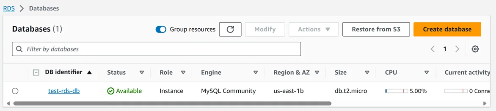

## Step 5: Create Elastic File System (EFS)

We will create an EFS with mount Target in the private data subnets in each availability zones. This will allow the webservers in the private app subnets to pull application code and configuration files from the same location. The webservers will use the EFS Mount Targets to connect to the EFS

  1. From the management console, type *EFS* in the search box and select EFS under services.
  2. Click on Create File system, then click Customize
  3. Give it a name (we will call it ***test-EFS***)
  4. Scroll all the way to Encryption. Check the box if you want to encrypt the file system data. We will uncheck it so we don’t get charged.
  5. Under tags, give a tag key and tag value, then click Next
  6. Under VPC, select your VPC (for this project, it is ***My VPC***)
  7. Under Mount targets, select the subnet for each availability zone. For us-east-1a, select ***Private Data Subnet AZ1***, and ***Private Data Subnet AZ2*** for us-east-1b. For each subnet, under security groups, remove the default security group and select ***EFS Security Group***
  8. We won’t add any file system policy, leave as default.
  9. Review, scroll down and click create.


## Step 6: Launch the Setup Server (EC2 Instance)

We will launch an ec2 instance that will be used to install WordPress.
  1. From the management console, type *EC2* in the search box and select EC2 under services.
  2. On the left side, select Instances -> Launch instances
  3. Give it a name (it will be ***setup server***)
  4. Under Quick Start tab -> Amazon Linux, select ***Amazon Linux 2023 AMI*** (it’s free within the Free Tier period)
  5. instance type: select ***t2.micro*** (which is also free)
  6. key pair name: select ***Proceed without a key pair*** (since we’ll use eic endpoint)
  7. Click “Edit” under network settings
  8. Under VPC, select our VPC (***My VPC***), and select ***Public Subnet AZ1*** under subnet
  9. Auto-assign public IP: select ***Enabled***
  10. Check *Select existing security group* and choose ***EC2-Instance Security Group***, ***ALB Security Group*** and ***Webserver Security Group***
  11. Scroll to the right, review the settings and click ***launch instance***
  12. Wait for some time for the instance state change to ***running*** and status check to be ***2/2 checks Passed***

## Step 7: SSH into the EC2 instance (launched in step 6)

Here we will use EC2 instance connect endpoint (eice) to ssh into our instance.
For the step-by-step process to create an EICE and ssh to the EC2 instance, click the link below to follow the guide. 
(https://medium.com/@mbohlip/how-to-ssh-into-an-ec2-instance-using-ec2-instance-connect-eic-endpoint-a7451a0940b4)

## Step 8: Install and configure WordPress

### I. After we have ssh into the setup server, we will run the following commands:

Before running these commands, we need to update the mount information of our EFS;
From EFS page -> select efs ID -> click attach, under ***using the NFS client***, copy the mount information ***fs-0b37356f0b8d8f269.efs.us-east-1.amazonaws.com*** (yours will be different from mine) and replace it in the fourth command line below

```bash
  # Create the html directory and mount the efs to it
  sudo su 
  yum update -y 
  mkdir -p /var/www/html
  sudo mount -t nfs4 -o nfsvers=4.1,rsize=1048576,wsize=1048576,hard,timeo=600,retrans=2,noresvport fs-0b37356f0b8d8f269.efs us-east-1.amazonaws.com:/ /var/www/html

  # install apache  
  sudo yum install -y httpd httpd-tools mod_ssl 
  sudo systemctl enable httpd
  sudo systemctl start httpd

  # install php 7.4 
  sudo yum clean metadata 
  sudo yum install php php-common php-pear -y 
  sudo yum install php-{cgi,curl,mbstring,gd,mysqlnd,gettext,json,xml,fpm,intl,zip} -y 
 
  # install mysql5.7 
  sudo rpm -Uvh https://dev.mysql.com/get/mysql57-community-release-el7-11.noarch.rpm 
  sudo rpm --import https://repo.mysql.com/RPM-GPG-KEY-mysql-2022 
  sudo yum install mysql-community-server -y 
  sudo systemctl enable mysqld 
  sudo systemctl start mysqld 
 
  # set permissions 
  sudo usermod -a -G apache ec2-user 
  sudo chown -R ec2-user:apache /var/www 
  sudo chmod 2775 /var/www && find /var/www -type d -exec sudo chmod 2775 {} \; 
  sudo find /var/www -type f -exec sudo chmod 0664 {} \; 
  chown apache:apache -R /var/www/html  
 
  # download wordpress files 
  wget https://wordpress.org/latest.tar.gz 
  tar -xzf latest.tar.gz 
  cp -r wordpress/* /var/www/html/ 
 
  # create the wp-config.php file 
  cp /var/www/html/wp-config-sample.php /var/www/html/wp-config.php 
 
  # edit the wp-config.php file 
  nano /var/www/html/wp-config.php
  # Once in the editor, we will update the following information
  DB_NAME: applicationdb
  DB_USER: test24
  DB_PASSWORD: Test1234
  DB_HOST: # (insert the RDS endpoint, from the RDS console -> Connectivity & security tab -> copy the endpoint)
  # to exit the editor, on your keyboard, press “CTRL+X”, then “Y”, then “Enter”
 
  # restart the webserver 
  service httpd restart
```
### II. Configure WordPress

Once we have restarted the Apache Web server, we need to finish WordPress installation. 
  1. From the EC2 (setup server) management console, copy the public IPv4 address and paste in a new browser page.
  2. Enter a Site title (we will use ***test***)
  3. Enter a username (we will use ***test24***) and password (we will use ***Test1234***)
  4. Enter an email (we will use ***mpndevops84@gmail.com***) and click ***Install WordPress***
  5. On the next page, click login, enter your username and password created above and click login.
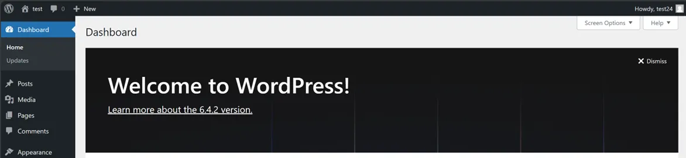

## Step 9: Create Application Load Balancer (ALB)

We will next create an application load balancer (ALB) that will route traffic to our webservers (ec2 instances) in the private subnet

### I. Launch an EC2 instance in each of the Private App Subnet AZ1 and Private App Subnet AZ2

  1. From the management console, type *EC2* in the search box and select EC2 under services.
  2. On the left side, select Instances -> Launch instances
  3. Give it a name (it will be ***WebServer AZ1***)
  4. Under Quick Start tab -> Amazon Linux, select ***Amazon Linux 2023 AMI*** (it’s free within the Free Tier period)
  5. Under instance type, select ***t2.micro*** (which is also free)
  6. Under key pair name, select ***Proceed without a key pair*** (since we’ll use eic endpoint)
  7. Click ***Edit*** under network settings
  8. Under VPC, select our VPC (***My VPC***), and select ***Private App Subnet AZ1*** under subnet
  9. Auto-assign public IP, select “Disabled”
  10. Check “Select existing security group” and choose “EC2-Instance Security Group, and Webserver Security Group”
  11. Scroll down to “Advanced details” and expand,
  12. Scroll down to “User data” and enter the bash script below: 
      *Replace the text ***fs-0b37356f0b8d8f269.efs.us-east-1.amazonaws.com*** (in the echo command) with what we copied in step 8 (I)*
```bash
      #!/bin/bash
      yum update -y
      sudo yum install -y httpd httpd-tools mod_ssl
      sudo systemctl enable httpd 
      sudo systemctl start httpd
      sudo yum clean metadata
      sudo yum install php php-common php-pear -y
      sudo yum install php-{cgi,curl,mbstring,gd,mysqlnd,gettext,json,xml,fpm,intl,zip} -y
      sudo rpm -Uvh https://dev.mysql.com/get/mysql57-community-release-el7-11.noarch.rpm
      sudo rpm --import https://repo.mysql.com/RPM-GPG-KEY-mysql-2022
      sudo yum install mysql-community-server -y
      sudo systemctl enable mysqld
      sudo systemctl start mysqld
      echo "fs-0b37356f0b8d8f269.efs.us-east-1.amazonaws.com:/ /var/www/html nfs4 nfsvers=4.1,rsize=1048576,wsize=1048576,hard,timeo=600,retrans=2 0 0" >> /etc/fstab
      mount -a
      chown apache:apache -R /var/www/html
      sudo service httpd restart
```
  13. Scroll to the right, review the settings and click ***launch instance***
  14. Wait for some time for the instance state = “running” and status check = “2/2 checks Passed”
  15. After launching the first instance, repeat the steps (1) to (14) to launch the second instance with name “WebServer AZ2” in Private App Subnet AZ2
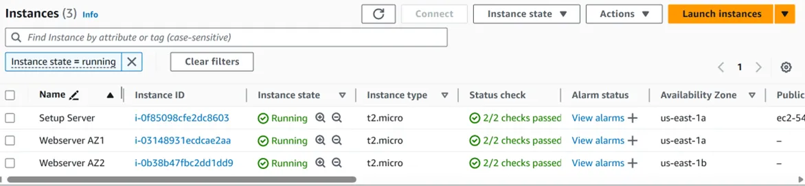

### II. Create a Target Group

We will create a target group and put these instances (created in step 9(I) above) in the target group to allow the ALB route traffic to them
  1. In the ec2 management console, on the left side, under load balancing, select Target groups -> Create target group
  2. target type: ***instances***
  3. target group name: give a name (it will be “Test-TG”)
  4. Protocol: ***HTTP***
  5. Under VPC, select your vpc (for our project, it is “My VPC”)
  5. Protocol version: ***HTTP1***
  6. Under Health checks, select advanced health checks settings
  7. Under success codes, enter ***200,301,302***
  8. Click Next
  9. On the next page, select the instances ***WebServer AZ1*** and ***WebServer AZ2*** and click on ***include as pending below***
  10. Click create target group
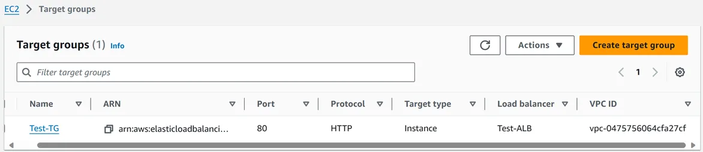

### III. Create an Application Load Balancer

  1. In the ec2 management console, on the left side, under load balancing, select Load Balancers -> Create Load Balancer
  2. Click create under the Application Load Balancer
  3. Give it a name (for our project, we will give ***Text-ALB***)
  4. It will be ***Internet-facing***
  5. IP address type: ***IPv4***
  6. Select our VPC (for our project, it will be ***My VPC***)
  7. Under mappings, we will select our 2 public subnets, so select ***us-east-1a*** and check ***Public Subnet AZ1***, similarly on ***us-east-1b***, check ***Public Subnet AZ2***
  8. Under Security groups, remove the default and select “ALB Security Group” from the dropdown
  9. Setup HTTP listener on port 80, under Default action, select your target group (***Test-TG***) from the dropdown list
  10. Scroll down and click Create load balancer
  11. Wait for the state to change to active.
  12. Once state is Active, copy the DNS name from the Description tab and paste in a new browser page to see our Website displayed.
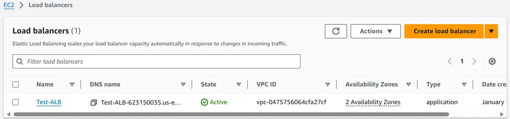

### IV. Change the domain settings in the WordPress configuration

  1. While still on the website page, at the end of the url link, add ***/wp-admin*** and press enter
  2. Login to your wordpress website with username and password created in step 8(II)
  3. On the left side, select settings -> General
  4. Under general settings, update both the WordPress Address (URL) and Site address (URL) and replace it with the DNS url copied in step III(l) above and remove the forward slash at the end
  5. Scroll down and save changes.
  6. It will log you out, just login again and check the website url should have changed.
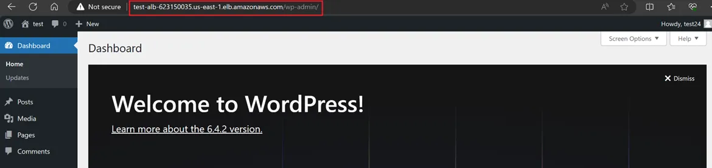

### V. Terminate the Setup Server

Now we have 2 webservers up and running and can access them using the DNS url of the ALB, so we don’t need the setup server anymore, hence we will terminate it
  1. From the EC2 management console, click on instance (running)
  2. Select the setup server, goto to instance state -> Terminate instance
  3. Then click terminate.

## Step 10: Register a Domain name in Route 53

We will register a domain name to allow users to access our website using a personalised domain name instead of using the ALB DNS url.
Click the link below to follow the step-by-step guide to register a domain in Route 53
https://medium.com/@mbohlip/register-a-domain-name-in-route-53-04f061b933a1
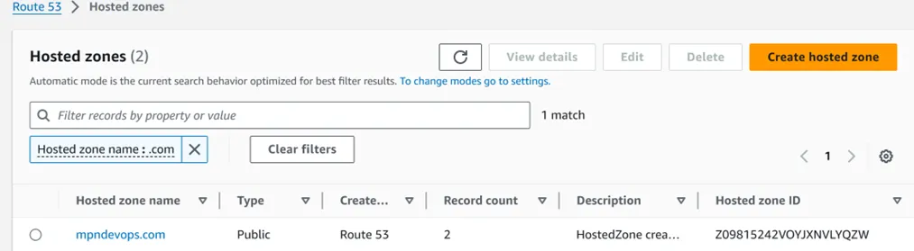

## Step 11: Create a Record Set in Route 53 and update WordPress admin portal

A record set in route 53 will enable us access our website using our domain name registered in step 10 above.
  1. From the AWS management console, search ***Route 53*** in the search box and select Route 53 under services
  2. On Route 53 Dashboard, click on ***Hosted zone***
  3. Click your domain name registered in step 10 (in our case, it will ***mpndevops.com***)
  4. Under Records, click Create record
  5. Record name will be ***www*** (for the subdomain)
  6. Record type will be ***A-Routes traffic to an IPv4 address and some AWS resources***
  7. Toggle Alias button ***ON***
  8. Under Route traffic to, select:
     ***Alias to Application and Classic Load Balancer*** for endpoint,
     ***US East (N. Virginia) [us-east-1]*** for the region,
     for Load balancer, select the ALB we created in step 9 (III) from the dropdown list
  9. Click Create records
  10. Click view status
  11. Wait for the status to change from Pending to ***INSYNC***
  12. Select the record just created, copy the record name under record details, paste it in a browser page and press Enter
  13. Copy the Url from the browser (in our case, it will ***http://www.mtndevops.com***)
  14. At the end of the url, add ***/wp-admin*** and press ENTER, then login with your username and password
  15. On the left side, select settings -> General
  16. Under general settings, update both the WordPress Address (URL) and Site address (URL) and replace it with the url copied in step (13) above and remove the forward slash at the end
  17. Scroll down and save changes.
  18. It will log you out, just login again and check the website url should have changed.
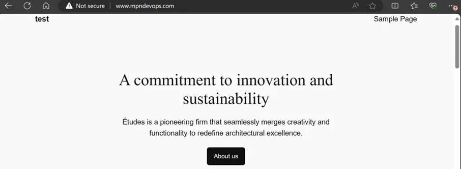

## Step 12: Register for an SSL Certificate in AWS Certificate Manager (ACM)

We will register a free SSL certificate in AWS Certificate Manager (ACM). If you already have a domain name with an SSL certificate, you can skip this step. This enables us to encrypt all communications between the browser and our webservers. This is referred to as Encryption in Transit
  1. From the AWS management console, search for Certificate manager in the search box and select Certificate manager under services
  2. In the Certificate manager console, click ***Request certificate***
  3. Select ***Request a Public certificate***, and click Next
  4. Under domain name, we will enter our domain we registered in step 10 above (we will use ***mpndevops.com***)
  5. Click Add another name to this certificate and enter “*.<your domain name>” (in our case, it will be “*.mpndevops.com”)
  6. Under validation method, select DNS validation
  7. Scroll down and click Request
  8. Under view certificate, the status will be “Pending validation”
  9. To validate, we need to create a record set in Route 53 to show this domain name belongs to us
  10. Click Create record in Route 53
  11. Then select both domain name and the wild card (“mpndevops.com”, “*.mpndevops.com”)
  12. Click Create records
  13. Click refresh and status will be “issued”
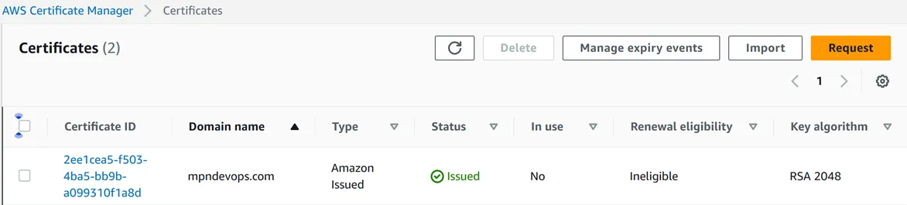
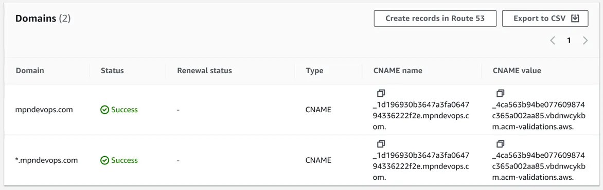

## Step 13: Create an HTTPS Listener for the Application Load Balancer (ALB)

We will create an HTTPS listener for our ALB to secure our website

### I. Create an HTTPS listener

  1. From the AWS management console, search for EC2 in the search box and select EC2 under services
  2. On the left, under Load balancing, select ***Load Balancers***, goto the Listeners tab and click ***Add Listener***
  3. Under Protocol, select ***HTTPS (443)***, then default actions will be ***Forward to***
  4. Under target group, select our target group from the dropdown list (in our case will ***Test-TG***)
  5. Under default certificate from ACM, select our certificate from the dropdown
  6. Click Add

  ### II. Edit HTTP listener to redirect traffic to HTTPS
  
  We now need to modify the HTTP listener to redirect all HTTP traffic to HTTPS.
  1. Select the HTTP listener and click on Edit
  2. Under default actions, select ***redirect***
  3. We will redirect it to HTTPS, type ***443***
  4. Scroll down and save changes

### III. Edit the wp-config file

To make sure our server is secure, we will edit the wp-config file in our webserver
  1. Using EICE, ssh into one of the webservers in the private subnet (Webserver AZ1 or Webserver AZ2)
  2. Change to root with the command ***sudo su***
  3. Type the command ```nano /var/www/html/wp-config.php ```
  4. Move down to the free space and paste the following code below
  ```bash
    /* SSL Settings */
    define('FORCE_SSL_ADMIN', true);
    // Get true SSL status from AWS load balancer
    if(isset($_SERVER['HTTP_X_FORWARDED_PROTO']) && $_SERVER['HTTP_X_FORWARDED_PROTO'] === 'https') {
      $_SERVER['HTTPS'] = '1';
    }
  ```
  5. Press ***CTRL+X*** then “***Y***”, then ***“Enter”*** to save and exit the editor
  6. Go ahead and test your website with https to confirm it’s secured, also test the website with http to confirm it redirects to https
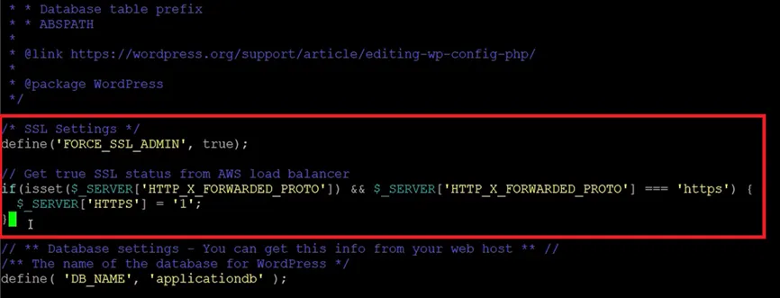

## Step 14: Create an Auto Scaling Group (ASG)

We are going to create an ASG. This will dynamically scale our webservers in the private subnets based on the demand from users.

### I. Terminate the 2 Webservers

First, we will terminate the 2 ec2 instances (“Webserver AZ1” and “Webserver AZ2”)
  1. From the EC2 dashboard, select instance (running)
  2. Then select Webserver AZ1 and Webserver AZ2, goto instance state -> Terminate instance
  3. Click Terminate

### II. Create a launch Template

A launch template has all the configurations on the ec2 that our ASG will use to create instances
  1. From the EC2 Management console, on the left, under instances select ***Launch Templates*** -> Create launch template
  2. Under Launch template name, give it a name (it will be ***Test-launch-Template***), enter same name for description
  3. Check the box under ***Auto Scaling Guidance***
  4. Under Quick Start tab -> Amazon Linux, select ***Amazon Linux 2023 AMI*** (it’s free within the Free tier period)
  5. instance type: ***t2.micro*** (which is also free)
  6. key pair name: ***Proceed without a key pair*** (since we’ll use eic endpoint)
  7. security groups: check ***Select existing security group*** and choose ***Webserver Security Group***
  8. Scroll down and click Advance
  9. Click on Advance and scroll down to the User Data section
  10. In this section, paste the following code
```bash
#!/bin/bash
yum update -y
sudo yum install -y httpd httpd-tools mod_ssl
sudo systemctl enable httpd 
sudo systemctl start httpd
sudo yum clean metadata
sudo yum install php php-common php-pear -y
sudo yum install php-{cgi,curl,mbstring,gd,mysqlnd,gettext,json,xml,fpm,intl,zip} -y
sudo rpm -Uvh https://dev.mysql.com/get/mysql57-community-release-el7-11.noarch.rpm
sudo rpm --import https://repo.mysql.com/RPM-GPG-KEY-mysql-2022
sudo yum install mysql-community-server -y
sudo systemctl enable mysqld
sudo systemctl start mysqld
echo "fs-0b37356f0b8d8f269.efs.us-east-1.amazonaws.com:/ /var/www/html nfs4 nfsvers=4.1,rsize=1048576,wsize=1048576,hard,timeo=600,retrans=2 0 0" >> /etc/fstab
mount -a
chown apache:apache -R /var/www/html
sudo service httpd restart
```
  11. After pasting the commands, click Create launch template
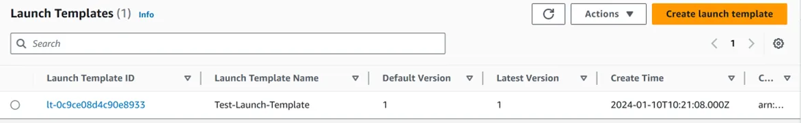

### III. Create the Auto Scaling Group (ASG)

  1. From the EC2 Management console, on the left, under Auto scaling, select ***Auto Scaling Groups*** -> Create Auto scaling group
  2. Give it a name (for our project, it will ***Test-ASG***)
  3. Under launch template, select our launch template from the dropdown list (***Test-launch-Template***), and click on Next
  4. Under VPC, select our VPC from the dropdown list (for our project ***My VPC***)
  5. Under availability zones and subnets, select ***Private App AZ1*** and ***Private App AZ2***, and click Next
  6. Select ***Attach to an existing Load balancer***
  7. Next select Choose from your load balancer target group
  8. Select our target group from dropdown list (***Test-TG***)
  9. Select ***ELB*** under health checks
  10. We can enable ***Enable group metrics collection within CloudWatch*** and click Next
  11. Under group size, let’s specify our Desired capacity = 2, Minimum capacity = 1, Maximum capacity = 4
  12. Scroll down and click Next
  13. Click ***Add notification***
  14. Click ***Create a topic***, once completed, click Next
  15. Under Add tags, click Add tags
  16. Give it a name and value (name = “Name”, Value = “Test-ASG”), click Nex, review settings and click Create auto scaling group
  17. At this moment, our ASG will be launching ec2 instances based on our desired capacity (which is 2)
  18. We can check the instances in EC2, wait for them to pass the “Status checks”, Next check if they are healthly in target group.
  19. Once this is all ok, we can check our website “www.devops.com”
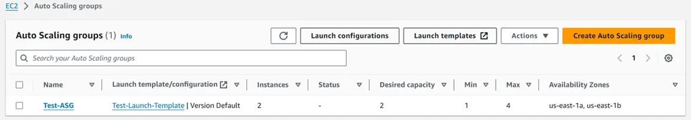
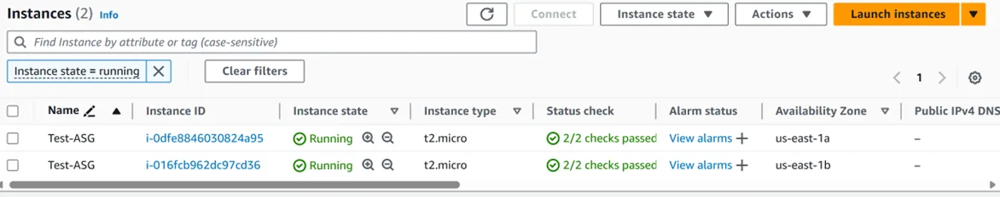
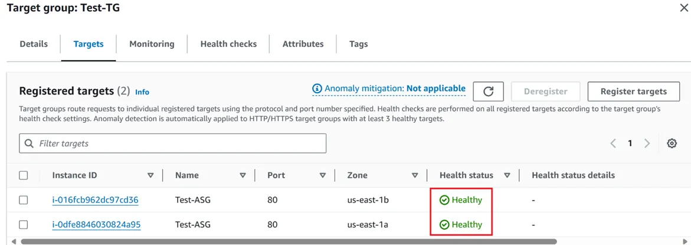

## Step 15: Install WordPress Theme and Template

In this last step, we will give our WordPress website a theme
